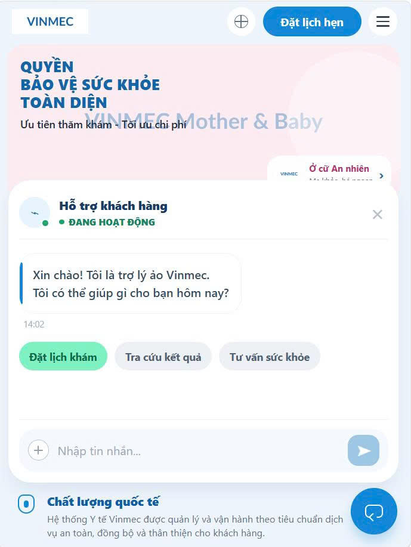

# Individual Reflection — Vũ Quang Dũng (2A202600442)

**Project:** VinmecPrep AI — Chatbot hỗ trợ bệnh nhân chuẩn bị trước khi khám tại Vinmec  
**Track:** Vinmec  
**Prototype level:** Working prototype

---

## 1. Role trong nhóm

Mobile engineering - phụ trách xây dựng prototype mobile và code phần giao diện mobile cho dự án.
Cụ thể: thiết kế giao diện, xây prototype cho chatbot trên mobile, code xây dựng UI-UX trên mobile, call API từ backend và xử lý một số trường hợp ngoại lệ.

---

## 2. Đóng góp cụ thể (có output rõ ràng)

**a. Xây dựng rptotype giao diện mobile**  
Lên ý tưởng, thiết kế giao diện cho hệ thống trên nền mobile cho phù hợp với nhóm khách hàng cần đi khám chữa bệnh và khách hàng của VinMed.

**b. Code giao diện (`mobile/`)**  
Code lại giao diện đã thiết kế bên trên với thư viện expo để tối ưu nhanh dung lượng, số thư viện cần cài, đảm bảo tốc độ thực thi và nhanh chóng có demo đến tay người dùng. Gọi API từ backend và xử lí một số trường hợp ngoại lệ như server lỗi, API không hoạt động.

---

## 3. SPEC — phần mạnh nhất và yếu nhất

**Mạnh nhất: Tốc độ**  
Chọn được thư viện và công nghệ không phải tốt nhất nhưng là tối ưu và phù hợp nhất: Expo để code mobile, đáp ứng được cho cả Android, IOS và web, nhanh chóng ra sản phẩm demo, có khả năng scale và cần cài rất ít thư viện, để dành bộ nhớ cho các mô hình AI và model lớn. Tốc độ xây dựng giao diện nhanh gọn, ít xung đột với code các thành viên khác. 

**Yếu nhất: Cài thư viện**  
Cài thư viện lâu, tốn bộ nhớ trên ổ đĩa, thư viện không tương thích với app điện thoại, gây mất thời gian debug và thiếu bộ nhớ khi buil dự án. Nếu làm lại sẽ dùng môi trường ảo venv hoặc conde để tải thư viện. Ngoài ra sẽ debug bằng log lỗi kết hợp hình ảnh thay vì chỉ dùng hình ảnh lỗi.

---

## 4. Đóng góp khác

- **Hỗ trợ test dự án:** Tham gia debug, hỏi tấn công chatbot để tìm kiếm lỗi bảo mật.

---

## 5. Điều học được trong hackathon mà trước đó chưa biết

Trước hackathon, mình code frontend bằng cách tạo thủ công thư mục/file, copy template rồi chỉnh sửa, vừa không đẹp vừa mất thời gian. Sau hackathon, mình học cách gen code bằng AI, nhưng có prompt rõ ràng, mô tả đúng - đủ để tạo giao diện đúng ý mình, nhanh, đẹp và mượt mà. 

---

## 6. Nếu làm lại, đổi gì

Sẽ mở ngay log ở terminal và trên app điện thoại để fix bug thay vì chỉ copy ảnh gửi cho AI kiểm tra. Việc đọc log giúp mình hiểu lỗi vướng ở đâu, từ đó có thể fix bug nhanh nhất, chuẩn nhất, bắt đúng bệnh. 

---

## 7. AI giúp gì — AI sai/mislead ở đâu

**AI giúp được:**
- Dùng Codex tạo giao diện chuẩn xác, mượt mà 
- Dùng AI để fix bug không kết nối được
- Gemini hỗ trợ các câu lệnh cài thư viện

**AI sai/mislead:**
- Fix bug sai dựa trên hình ảnh cung cấp
